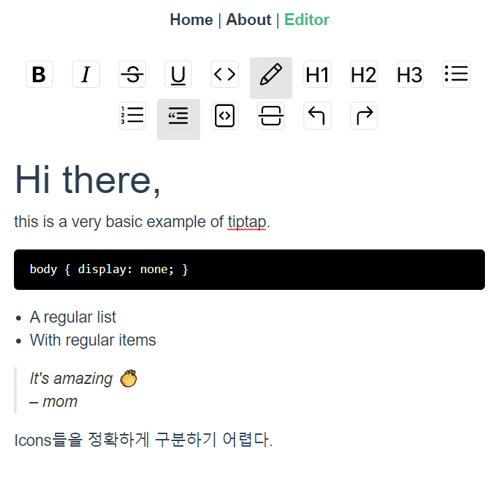

## 07.20

1. 한 것.
   
   - [ ] Vue를 이용한 Tiptap 구현.
2. 할 것.
   - [ ] scss를 통해 design 필요.
   - [ ] bold, H1 같은 명령어를 Icon으로 변경.
   
   

## 07.21

1. 한 것
   - [ ] Vuetify를 이용한 Tiptap 구현
   - [ ] Bootstrap-Vue를 이용한 text-align, Icon 추가
2. 할 것
   - [ ] css, Tiptap extension 기능 추가
3. Issue
   - [ ] Icons들을 정확하게 구분불가.
   - [ ] 의미가 애매.

4. 사용할 것들
   1. https://bootstrap-vue.org/docs/components/dropdown#foo/bar
5. 물어볼 것
   1. electron의 sizing 정도
   2. div안에 넣을지??
   3. 문서 저장을 어떻게 할까??
   4. 스크롤 했을 때 Button Bar가 우측으로 이동하도록
   5. 